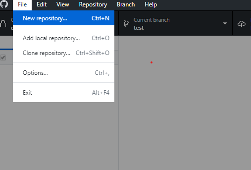
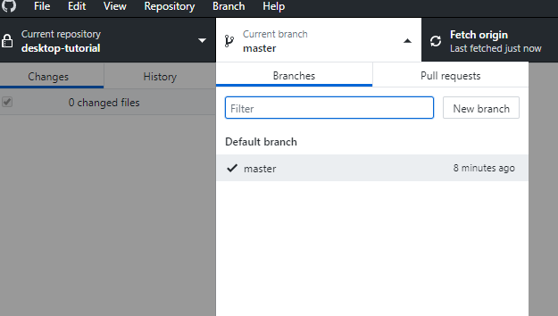
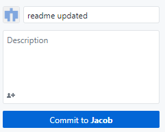
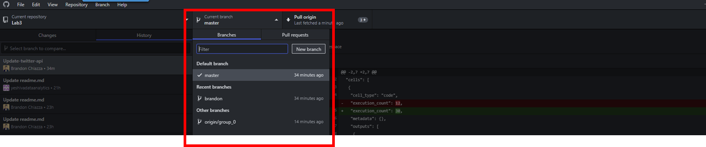
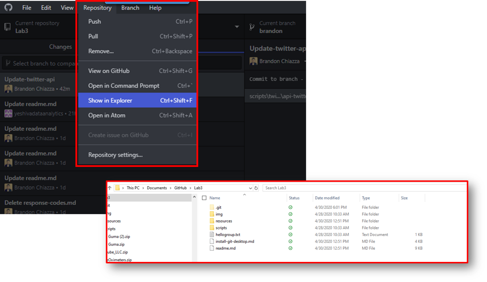
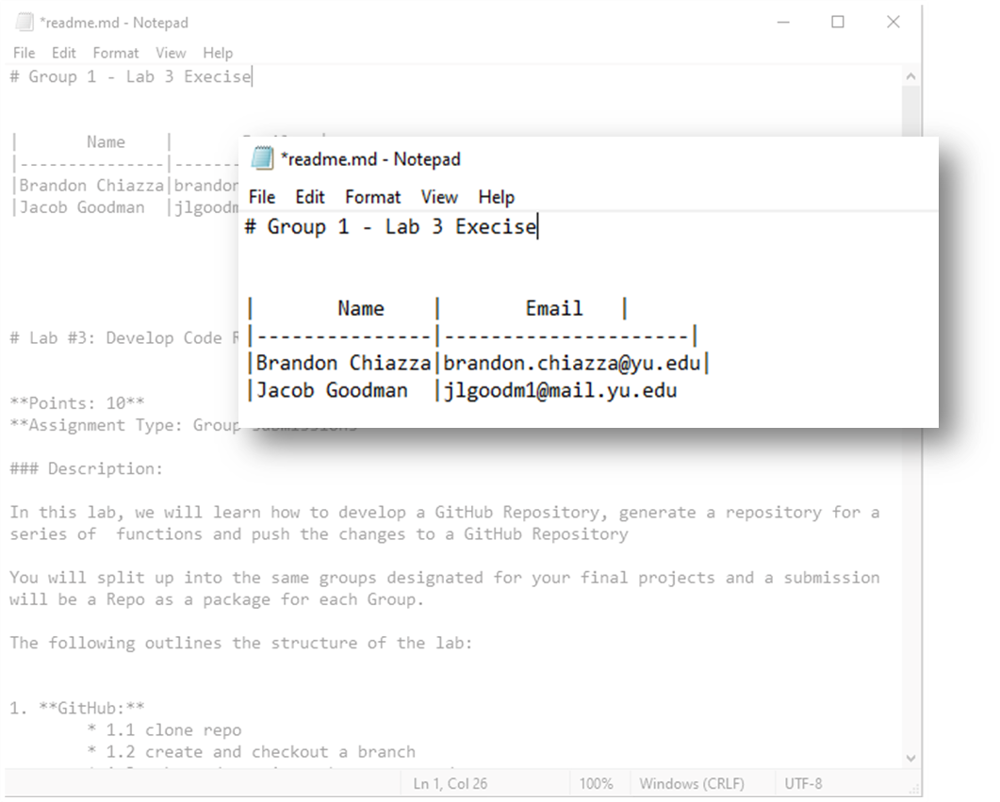
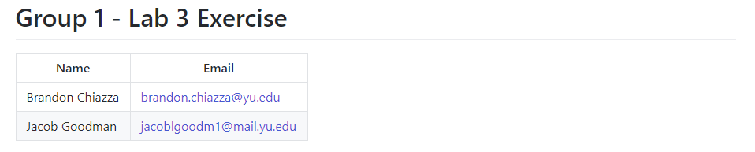
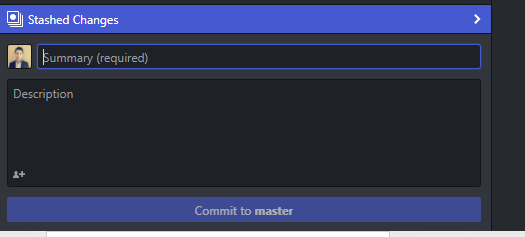

# Lab #3: Develop Code Repository and Push Commits 


**Points: 10**  
**Assignment Type: Group submissions**


### Description:

In this lab, we will learn how to develop a GitHub Repository, generate a repository for a series of  functions and push the changes to a GitHub Repository

You will split up into the same groups designated for your final projects and a submission will be a Repo as a package for each Group. 

The following outlines the structure of the lab: 

1. **GitHub: Clone the repo and create a group branch**
	* Step 1. clone repo 
	* Step 2. create and checkout a branch
	* Step 3. make and commit a change to readme.txt
	* Step 4. push your changes back to GitHub
	* Step 5. merge your changes on github.com
	* Step 6. check out your groups branch before moving on to part 2
	
2. **Run a Twitter API and load file into Amazon S3**
	* Step 1. Connect to your branch for your group through GitHub Desktop.
	* Step 2. Update the readme.md markdown file with your group name information
	* Step 3. Coordinate with your group to ensure you can run the script that exists.
	* Step 4. Modify the script to change the filename to include your Group name
	* Step 5. Create a commit to the branch and notify the professor of your changes to be merged with master.

## 1. GitHub:

For an overview on how to commit changes to a branch and merge with a master set of Code, please review the following link: 

[Committing and Reviewing Changes to your Project](https://help.github.com/en/desktop/contributing-to-projects/committing-and-reviewing-changes-to-your-project)

### 1.1 clone repo 

The first step is to "Clone" the repository. This copy's the files to your local computer and creates a connection to repository. 

From the command you can type the following command: 

```bash
git clone <repo url> #replace <repo url> with the url of the reposiotry on github
```


From GitHub desktop you can select clone from the file drop down your use the shortcut `Ctrl+shift+O`:




### 1.2 Create and checkout a branch 


Once we have cloned the repository, we will create a new **branch** with our *name* and  moved our git to this branch by **checking** it out. This will allow us to make and save changes without affecting the "master" branch.

From the command line, 

1. navigate into the repo. 

   ```bash
   cd <repo name> # cd stands for change directory and moves us to the folder we specify <repo name>
   ```

   

2. Create a new branch and check it out we use the checkout command.
```bash
git checkout -b <new-branch>  # the -b flag allows us to create a new repo and check it out in the
						    # same step. don't forget to replace <new-branch> with your name
```

From GitHub desktop, click the current branch dropdown and then select new branch  




### 1.3 make and commit a change to hellogroup.txt

We are now going to modify this repository and save those changes into git by **Committing ** them to the repository.  This will allow us to share our changes back to the repository on github.com.	


We will now make an update to repository:
1. Open the hellogroup.txt file located in the base directory of the repository
2. Write a message for your group
3.  Save the file
4.  Commit those changes 

From the command line to commit changes we must first stage them with `git add` . once 
```bash
git add . # add all files that have changes 
git status # see the changes that are staged
git commit -m "put your commit message here" # commit your changes with a message

```


On GitHub desktop we use the commit button on the bottom left of the screen. 



### 1.4  Push your changes back to GitHub

Once we have have committed our changes to the Local repository we want to share them so our group can see the nice message we wrote them. to do this we **push** the changes. 


From the command line, we use the `push` command. because this is the first time you are pushing this repo and because our new branch doesn't yet exist on github.com we have to use the `-u` option ,which sets the upstream branch so git knows where to push our updates in the future, and we need to specific the remote: origin (the default) and branch name. 


```bash
git push -u origin <branchname> # push your changes to a new remote branch
```


On GitHub desktop the publish branch button will push our changes to a new branch on Github.com  


### 1.5 Merge changes 

Once our branch is published to github.com we want to merge those changes back to the master branch. 


#### 1.5.1 Open a pull request on the repo  https://github.com/yeshivadataanalytics/Lab-03


git

#### 1.5.2 Select your groups branch and the one that you just made


#### 1.5.3 Resolve any conflicts


#### 1.5.4 commit the merge and close the Pull Request


<br>


### 1.6  check out your groups branch before moving on to part 2

before we move to part 2 we will update our local repository and check out our groups branch
```bash 
git fetch --all #get updates to all branches
git checkout  {group_0} # replace with your groups name 

```
from GitHub desktop 

first run fetch:


then select your groups branch from the branch drop down:


<b>Congratulations! You are now a GitHub collaborator!</b>


# 2. Run a Twitter API and load file into Amazon S3

Now that you have installed GitHub Desktop and collaborated on a piece of code, we are going to develop a basic API call to pull data from a web service and convert it into a file to be posted to Amazon S3. The goal of this part of the Lab is to:

1. Understand how to run an API call through python with basics of sequencing
2. Learn to commit changes to a branch
3. Convert requests from APIs into a dataframe and post to Amazon S3

We have already set up branches for each of your groups and made sure that you have collaborators for each group.

This part of the lab is going to require you to take the following steps:

- **Step 1.** Connect to your branch for your group through GitHub Desktop.
- **Step 2.** Update the readme.md markdown file with your group name information
- **Step 3.** Coordinate with your group to ensure you can run the script that exists.
- **Step 4.** Modify the script to change the filename to include your Group name
- **Step 5.** Create a commit to the branch and notify the professor of your changes to be merged with master.

## Step 1. Connect to your branch for your group through GitHub Desktop.

- Per Part I of the lab you have already cloned the Lab3 repository in your local GitHub Desktop code management system.
- Log into GitHub Desktop and navigate to the &quot;Current branch&quot; drop down.



## Step 2. Update the readme.md markdown file with your group name information

- Once you have selected a group member, navigate to the repository selector and click &quot;Show in Explorer&quot; on a Windows machine. This will take you to the local path for your GitHub repository. See below



- Once you have navigated there, open the readme.md file with your favorite code editor (could be Notepad on Windows machine):



- Your result should look something like this at the top of the readme.md file



- Now commit your changes to your branch with a comment. Note: make sure you are committing to your branch!



## Step 3. Coordinate with your group to ensure you can run the script that exists.

- Before you begin, you must copy and paste the _twitter\_keys.py_ file to the location where you run your package installation. These are the keys that are required to run the Twitter API.
  - Take the twitter\_keys.py file and move it into the lib folder of your anaconda installation:
 \*_Anaconda3\lib\*_
  - if you don&#39;t know where your anaconda folder is you can find it with the following command on the command line
  - which anaconda # this command should work on both windows and mac
- Follow along for the introductory session on running this script. You should start the Jupyter Notebook file by navigating to its location and running it using Jupyter Notebook.
- The sequence diagram below allows us to move through this API call.
  - Here are the steps we are taking:
    - Authenticating using authentication leys and tokens ([_What is token-based authentication?_)](https://stackoverflow.com/questions/1592534/what-is-token-based-authentication)
    - Create search parameters
    - Pass those search parameters to Twitter&#39;s API and return results
    - Convert the results to a dataframe
    - Send those results as a CSV file to the S3 bucket called &quot;s3:/lab-03/&quot;


## Step 4. Modify the script to change the filename to include your Group name

1. groupname= &#39;Group\_1\_&#39; #name of your group
2. Make any other changes you&#39;d like to the search parameters. See [here](https://developer.twitter.com/en/docs/tweets/search/api-reference/get-search-tweets) for a standard list of parameters.

## Step 5. Create a commit to the branch and notify the professor of your changes to be merged with master.


