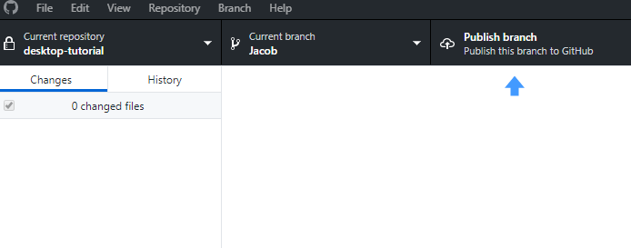
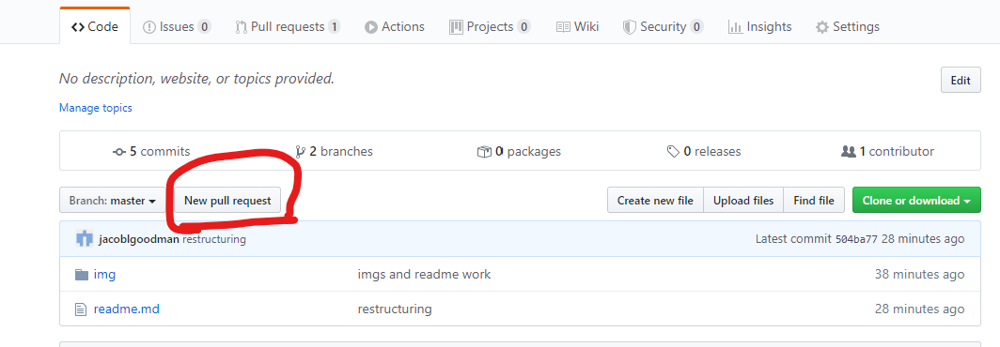
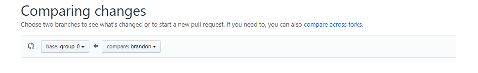
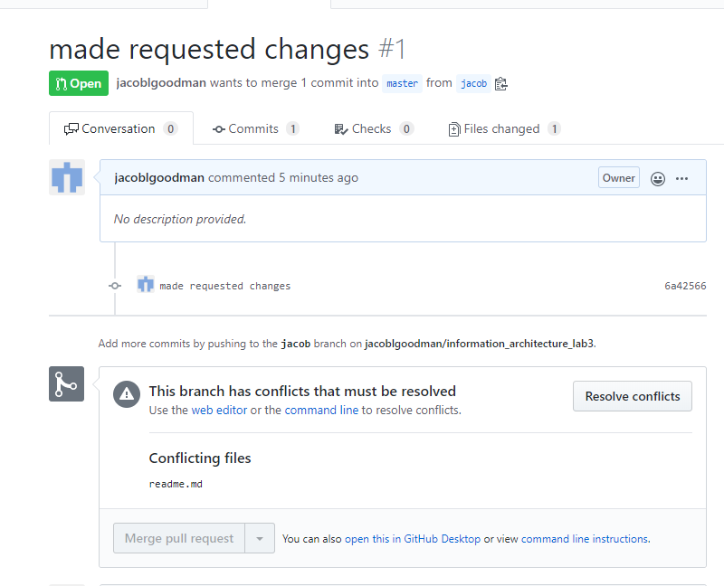
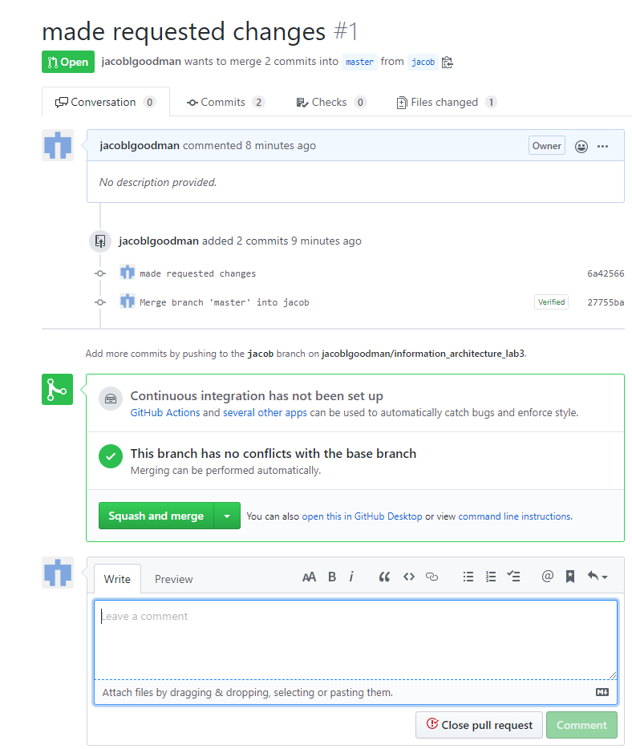

# Lab #3: Develop Code Repository and Push Commits 


**Points: 10 **
**Assignment Type: Group submissions**

### Description:

In this lab, we will learn how to develop a GitHub Repository, generate a repository for a series of  functions and push the changes to a GitHub Repository

You will split up into the same groups designated for your final projects and a submission will be a Repo as a package for each Group. 

The following outlines the structure of the lab: 


1. **GitHub:**
	1.1 clone repo 
	1.2 create and checkout a branch
	1.3 make and commit a change to readme.txt
	1.4 push your changes back to GitHub
	1.5 merge your changes on github.com

2. **script: download date from API and save to S3**
	2.1. open .ipynb in jupyter
	2.2 Updates
	2.3 save to S3


## 1. GitHub:
### 1.1 clone repo 

```bash
git clone <repo url>
```

GitHub desktop:


### 1.2 create and checkout a branch 

```bash
git checkout -b <new-branch>
```

GitHub desktop:


### 1.3 make and commit a change to readme.txt

* **Modify the text in the  box below put a message to your group,**

```
adding above

looking a how to merge files 

and below

```
* Save the file
* Commit those changes 

```bash
git add . # add all files that have changes 
git status # see the changes that are staged
git commit -m "put your commit message here" # commit your changes with a message

```
GitHub desktop:


### 1.4  Push your changes back to GitHub


```bash
git push -u origin <branchname> #push your changes to a new remote branch
```


### 1.6 Merge changes 

Open a pull request on the repo www.github.com/jacoblgoodman/{repo}>




select the branch that you pushed



resolve and conflicts




commit the merge and close the Pull Request




Congradulations youre now a git colaborator 


## 2. script: download date from API and save to S3:


Create web-scraper to load csv file into S3 Bucket

9. Run and update web-scraper to iterate through all records stored on the Charities Bureau Website


    1.0 Create GitHub Branch and Repo and Add Team (2 pts.) 
    In this portion of the lab, you will create a GitHub branch to manage your code across your group. You should nominate 
    • Step 1. Use your GitHub account to create a new branch and repository and input the relevant code. 
        ◦ Step 1.1 Title the branch after your group and the lab (e.g., “Group_1_Lab_03”)
    • Step 2. Enable for cloning for your team and have each team member clone repository to their local GitHub instance

    • Step 3. Create a READ_ME.md file for this project

    • Step 4. Copy the link to the repo and give brandonchiazza@gmail.com permissions. Share it as part of your response to this lab. 

Once you have completed this portion of the lab save your output files in a zipped packaged and send them to brandon.chiazza@yu.edu. You should send one per group. Your file name should look like: <<Group_Name>>_Lab_3_Submission_1


    2.0 Create web-scraper to load csv file into S3 Bucket (4 pts.)
Note: there are dependencies. You will need to configure and install awscli and boto3 and be sure you give access to an S3 bucket. You can find documentation here. Additional modules required include csv, pandas, dataframe, selenium, BeautifulSoup. 	
For this portion of the lab, we will be creating a web scraper to parse a table from the Charities Bureau Website. From the website: “All charitable organizations operating in New York State are required by law to register and file annual financial reports with the Attorney General's Office. This includes any organization that conducts charitable activities, holds property that is used for charitable purposes, or solicits financial or other contributions.”
The site will contain vendor information and you are being tasked with culling a list into a csv file by scraping the website using the selenium module in Python. 
To begin take the following steps:
    • Step 1. Load the script, scrape-to-csv-local.py, to your repository
    • Step 2. Inspect the script, update the output file directory, and attempt to run the script. Become familiar with the Charities Bureau Website that is being scraped. 
    • Step 3. Test the file locally
    • Step 4. Once this works, commit the updated file to the repository (nominate one person to do this and another to peer review!)
    • Step 3. Produce the csv output and ensure that the data from the dataframe exported appropriately
    • Step 4. Save the file and take a screenshot of the directory that the file was saved to.
Variant: load the file into an s3 bucket
    • Step 1. Load the script, scrape-to-s3.py into your repository as a separate file
    • Step 2. Create an s3 bucket to store your outputs of csv files. Note: I used a bucket named ‘database-update-bucket’. Be sure to make the settings on the s3 buckets public. As part of configuration of the awscli, you should ensure that you have access to s3 and the AWS environment. 
    • Step 3. Update the scrape-to-s3.py file to include your s3 path
    • Step 4. Test the file by inspecting the output on the s3 bucket
    • Step 5. Once the test has passed, commit the changes to the master branch of your GitHub repository
    • Step 6. Note that the output of the file has an issue! The header inserts a blank row! Update the script to remove the blank row in the csv output file
    • Step 7. Test the file by inspecting the output on the s3 bucket
    • Step 8. Once the test has passed, commit the changes to the master branch of your GitHub repository
    • Step 9. Provide evidence that the file and script were successfully updated by providing the link to s3 and the .py file in the repository. 
Be sure to update your READ_ME.md file to reflect the script actions and ensure proper documentation.
Once you have completed this portion of the lab save your output files in a zipped packaged and send them to brandon.chiazza@yu.edu. You should send one per group. Your file name should look like: <<Group_Name>>_Lab_3_Submission_2

    3.0 Update web-scraper to iterate all results and load csv file into S3 Bucket (4 pts.)
For this portion of the lab, you should do this outside of class and with your team. You are going to alter the script, scrape-to-s3.py, to iterate through the pagination that exists on the page and compile all of the results in one dataframe from each page. Once you have done that, you should follow the same procedures in (2) to load the full csv file into the s3 bucket. 
Once the test has passed, commit the changes to the master branch of your GitHub repository. Provide evidence that the file and script were successfully updated by providing the link to s3 file and the .py file in the repository.


Once you have completed this portion of the lab save your output files in a zipped packaged and send them to brandon.chiazza@yu.edu. You should send one per group. Your file name should look like: <<Group_Name>>_Lab_3_Submission_3

    4.0 BONUS: Use (3) to create a lambda function to run on a schedule to generate any updates from Charities Bureau Website. (5 pts.)
To earn extra points, you can compile your webscraping code into a zipped package and create the crawler in a lambda function to run on a schedule and run updates to the data file. From there, see if you can load the data into a simple MySQL RDS instance. The Python script should be able to accommodate all. 
